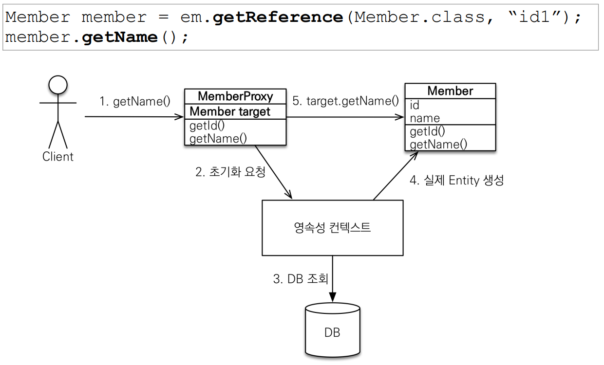
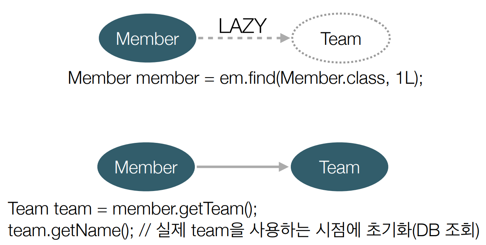

# TIL

## 07/15
코로나 이슈

## 07/16
### EasyOCR
- Detection은 Clova AI의 CRAFT 알고리즘을 사용
- CRNN
- Tesseract와의 차이점
  - Tesseract와 달리 GPU 지원
  - 한 번 실행에 여러 언어 인식을 제공
  - Tesseract보다 텍스트 인식에 시간이 더 소요된다는 단점
### API 명세서 작성
- 회원
  - 회원가입
  - 모든 회원 조회
  - 아이디 중복 확인
  - 닉네임 중복 확인
  - 특정 고객 조회
  - 특정 회원 수정
  - 특정 회원 탈퇴
  - 받아쓰기 채점
  - 복습 문장 추가
  - 복습 문장 주제 및 키워드 별 조회
  - 복습 문장 삭제
- 코알라
  - 코알라 정보 조회
  - 코알라 이름 수정
  - 코알라 먹이주기
- 커뮤니티
  - 게시글 작성
  - 게시글 전체 조회
  - 특정 게시글 상세 조회
  - 게시글 전체 조회-조회수 정렬
  - 특정 회원 게시글 조회
  - 게시글 수정
  - 게시글 삭제
  - 게시글 댓글 조회
  - 게시글 댓글 작성
  - 게시글 댓글 수정
  - 게시글 댓글 삭제
## 07/17
### JPA 학습
#### 프록시
```markdown
em.find() - 데이터베이스를 통해서 실제 엔티티 객체 조회
em.getReference() - 데이터베이스 조회를 미루는 가짜(프록시) 엔티티 객체 조회
```
```markdown
프록시 특징
- 실제 클래스를 상속 받아서 만들어짐
- 실제 클래스와 겉 모양이 같다.
- 사용하는 입장에서는 진짜 객체인지 프록시 객체인지 구분하지 않고 사용하면 됨(이론상)
- 프록시 객체는 실제 객치의 참조(target)를 보관
- 프록시 객체를 호출하면 프록시 객체는 실제 객체의 메서드 호출

- 프록시 객체는 처음 사용할 때 한번만 초기화
- 프록시 객체를 초기화 할 때, 프록시 객체가 실제 엔티티로 바뀌는 것은 아님, 초기화되면 프록시 객체를 통해서 실제 엔티티에 접근 가능
- 프로식 객체는 원본 엔티티를 상속받음, 따라서 타입 체크시 주의해야함(== 비교 실패,대신 instance of 사용)
- 영속성 컨텍스트에 찾는 엔티티가 이미 있으면 em.getReference()를 호출해도 실제 엔티티 반환 / 영속성 컨텍스트에 프록시가 있으면 프록시 반환
- 영속성 컨텍스트의 도움을 받을 수 없는 준영속 상태일 때, 프록시를 초기화하면 문제 발생
(하이버네이트는 org.hibernate.LazyInitializationException 예외를 터뜨림)
```
##### 프록시 객체의 초기화

##### 프록시 확인
- 프록시 인스턴스의 초기화 여부 확인 : PersistenceUnitUtil.isLoaded(Object entity)
- 프록시 클래스 확인 방법 : entity.getClass().getName(), 출력 : ..javasist.. or HibernateProxy…
- 프록시 강제 초기화 : org.hibernate.Hibernate.initialize(entity);
- 참고: JPA 표준은 강제 초기화 없음, 강제 호출: member.getName()
##### 지연 로딩 LAZY를 사용해서 프록시로 조회

